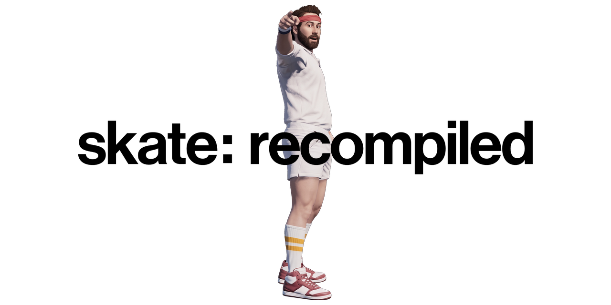

<picture>
  <source media="(prefers-color-scheme: dark)" srcset="banner.png">
  <source media="(prefers-color-scheme: light)" srcset="banner-light.png">
  
</picture>

A **Nix / NixOS** fork of [skate3recomp](https://github.com/mchughalex/skate3recomp), the unofficial
native recompilation of the Xbox 360 version of Skate 3. This fork adds a `flake.nix` that provides
a fully reproducible build environment so the project builds and runs on NixOS (and any machine with
the Nix package manager) without an `apt install` or a global toolchain. Everything else — the
runtime, codegen, and rexglue SDK fork — is unchanged from upstream.

The game is currently capable of running at ~165FPS at 4K with MSAA, using an RTX 4090.

The project does not include Skate 3 retail game files. To run or build the project, you must provide
files from your own legally obtained Xbox 360 copy of Skate 3.

> **Why this fork?** On NixOS there is no `/usr/lib` or system dynamic linker, so the upstream
> `apt`-based Linux instructions don't apply. The flake supplies Clang 20, CMake, Ninja, Vulkan, GTK 3,
> and the audio/input libraries, and shims the version-suffixed compiler names (`clang-20`,
> `clang++-20`, `ld.lld-20`) the CMake presets expect — so the upstream presets run **unmodified**.

## How Do I Play?

Prebuilt releases (Windows/Linux/macOS) are published by **upstream**, not this fork. Grab them from
the [upstream releases page](https://github.com/mchughalex/skate3recomp/releases). This fork exists to
**build from source on Nix** — see [Nix Build](#nix-build) below.

## Nix Build

These instructions target NixOS or any Linux with the Nix package manager and
[flakes enabled](https://nixos.wiki/wiki/Flakes) (`experimental-features = nix-command flakes`).

ReXGlue requires Clang. This flake pins **Clang 20**, matching the Linux toolchain used by the rexglue
SDK CI and avoiding the `std::expected` feature-test mismatch seen with older Clang/libstdc++ combos.

Clone with submodules:

```sh
git clone --recursive git@github.com:JuiceyDew/Skate3-Recomp-Nix.git skate3recomp
cd skate3recomp
```

If you already cloned without submodules:

```sh
git submodule sync --recursive
git submodule update --init --recursive --jobs "$(nproc 2>/dev/null || echo 4)"
```

Enter the development shell. This pulls Clang 20, CMake, Ninja, Vulkan, GTK 3, and the audio/input
libraries, and sets up the `clang-20` / `clang++-20` / `ld.lld-20` shims and Vulkan loader paths:

```sh
nix develop
```

The build-time codegen needs an extracted game dump containing `default.xex` and
`data/webkit/EAWebkit.xex`. Put that dump in `game/`, or pass a path with `SKATE3_GAME_DATA_ROOT`:

```sh
mkdir -p game
cp /path/to/default.xex /path/to/EAWebkit.xex game/
```

Generate the recompiled source, reconfigure so CMake sees the generated source lists, and build
(run these **inside** the `nix develop` shell):

```sh
cmake --preset linux-relwithdebinfo -DSKATE3_GAME_DATA_ROOT="$PWD/game"
cmake --build --preset linux-relwithdebinfo --target generate-all --parallel
cmake --preset linux-relwithdebinfo -DSKATE3_GAME_DATA_ROOT="$PWD/game"
cmake --build --preset linux-relwithdebinfo --parallel
```

Build a Linux release with the `linux-release` preset. The release artifacts are:

```text
out/build/linux-release/skate3
out/build/linux-release/librexruntime.so
```

### GPU drivers (Vulkan ICD)

The flake's `shellHook` points `VK_ICD_FILENAMES` at the system NixOS GPU driver under
`/run/opengl-driver`. This requires `hardware.graphics.enable = true;` in your NixOS configuration
(the default on most desktop setups). Check which ICD matches your card and trim the
`VK_ICD_FILENAMES` line in `flake.nix` accordingly:

```sh
ls /run/opengl-driver/share/vulkan/icd.d/
vulkaninfo | head   # should report your GPU; run inside the nix develop shell
```

## Running a Development Build

On Linux, inside the `nix develop` shell:

```sh
./scripts/run-linux.sh
```

The launcher sets `LD_LIBRARY_PATH` for development builds, passes `--game_data_root="$PWD/game"`, and
selects SDL controller input on Linux. To use a game dump outside the repository:

```sh
SKATE3_GAME_DATA_ROOT="/path/to/extracted/game" ./scripts/run-linux.sh
```

Keyboard-to-controller emulation is off by default. Pass `--mnk_mode` or set `SKATE3_MNK=1` to enable
it:

```sh
SKATE3_MNK=1 ./scripts/run-linux.sh
```

Fullscreen is on by default. Pass `--no-fullscreen` to start windowed.

To run the Linux development executable directly:

```sh
LD_LIBRARY_PATH="$PWD/third_party/rexglue-sdk/out/linux-amd64${LD_LIBRARY_PATH:+:$LD_LIBRARY_PATH}" \
  ./out/build/linux-relwithdebinfo/skate3 --game_data_root="$PWD/game" --input_backend=sdl
```

## Installing DLC

To use DLC, you must provide package files from your own legally obtained Xbox 360 DLC.

Create a `dlc` folder either beside the executable, inside the installed game folder, or in the user
data folder. Place the DLC package files in that folder and start the game.

## True 21:9 Ultrawide

The builds include an experimental true ultrawide aspect ratio mode at 21:9. You may notice occasional
visual bugs or graphical glitches, especially around shadows. Performance is somewhat reduced.

## Controls

- Standard Xbox controls using an Xbox controller are the preferred and main input method. DualShock
  and others are untested, but are likely to work with Steam Input through XInput.
- Keyboard controls can be enabled in the game settings menu.
- Press Escape on keyboard or (Back + Start) on the controller to open the game settings menu.

### Keyboard Keybinds

- Left stick: W/A/S/D
- Right stick: mouse movement
- A/B/X/Y: Space/C/E/F
- LT/RT: RMB/LMB
- LB/RB: Q/R
- Left stick press: Shift
- Right stick press: MMB
- Back/Start: Tab/Return

## rexglue Fork

`third_party/rexglue-sdk` is pinned as a Git submodule to the `skate3-sdk-clean` branch of the
Skate-specific rexglue fork. Clone recursively or run:

```sh
git submodule sync --recursive
git submodule update --init --recursive --jobs "$(nproc 2>/dev/null || echo 4)"
```

The fork is based on rexglue's 0.8.0 release line and contains the Skate 3 runtime, codegen, input,
graphics, timing, and Linux fixes needed by this project.

## Credits

- [skate3recomp](https://github.com/mchughalex/skate3recomp) by mchughalex — the upstream project this
  is forked from.
- [rexglue SDK](https://github.com/rexglue/rexglue-sdk), the recompilation SDK used by this project.
- [Xenia](https://github.com/xenia-project/xenia), whose Xbox 360 research and tooling have helped the
  broader recompilation ecosystem.
